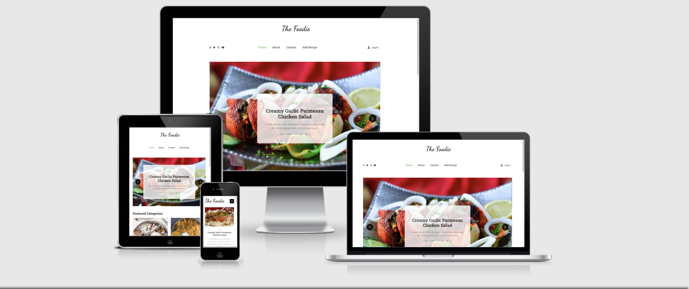

## Code Institute Data Centric Development Milestone Project

---

# The Foodie

The Foodie is an online platform where users can share recipes and ideas. The user can create their own personal account where they can add, edit and delete recipies at their leisure. They can also leave commments on any shared recipe on the site.

[Visit deployed website]()

## Table of Contents

---

-   [UI/UX](#UI/UX)
    -   [Project goals](#ProjectGoals)
    -   [User Stories](#UserStories)
    -   [Developer goals](#DeveloperGoals)
    -   [Design](#Design)
        -   [Research](#Research)
        -   [Wireframes](#Wireframes)
        -   [ColorPallette](#ColorPallette)
    -   [Defensive Design](#DefensiveDesign)
-   [Features](#Features)
    -   [Notes](#Notes)
    -   [Existing features](#ExistingFeatures)
    -   [Future features](#FutureFeatures)
-   [Information Architecture](#InformationArchitecture)
-   [Technologies Used](#TechnologiesUsed)
-   [Testing](#Testing)
    -   [Validators and linters](#)
    -   [Manual Testing](#)
    -   [Errors](#)
-   [Deployment](#)
-   [UI/UX](#)
-   [Credits](#)
    -   [Code](#)
    -   [Images](#)
-   [Acknowledgements](#)
-   [Disclaimer](#)

---

## UI/UX

---

### Project goals

The goal of this project was to create an application that would allow users to share recipies from accross the world. The app allows the user to create, read, update and delete their data (CRUD). The app also allows the user to view and leave comments on any uploaded recipe. It provides a platform for all the food lovers out there to share and also try new recipes.
